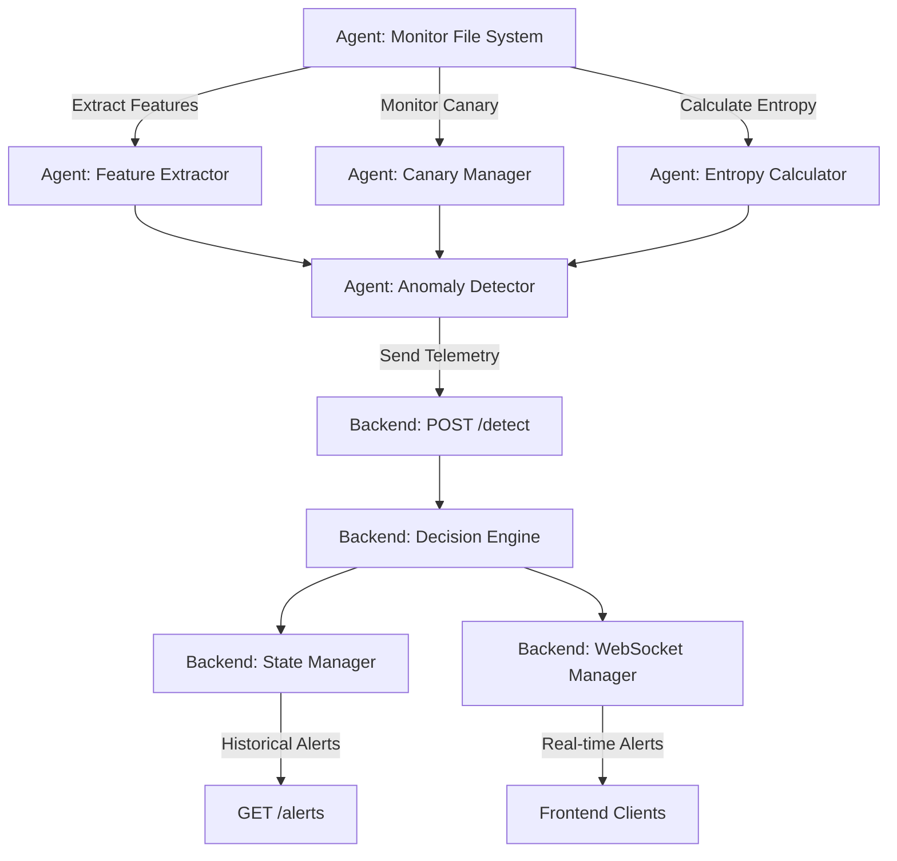

# System Architecture

## Overview
The Ransomware Defense System consists of two primary components:
1. **Agent**: A lightweight background process that monitors specific directories for suspicious file activity indicative of ransomware (e.g., mass encryption, high entropy changes, canary file triggers).
2. **Backend**: A central server that receives telemetry from the agents, decides the system state, and broadcasts alerts to administrators.

## Component Diagram

